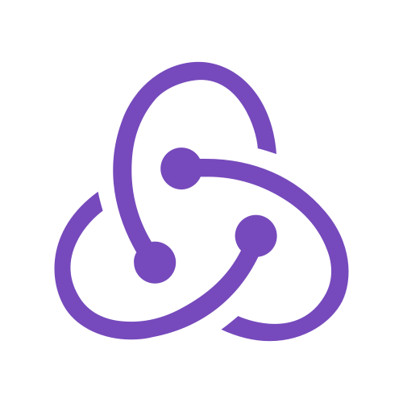
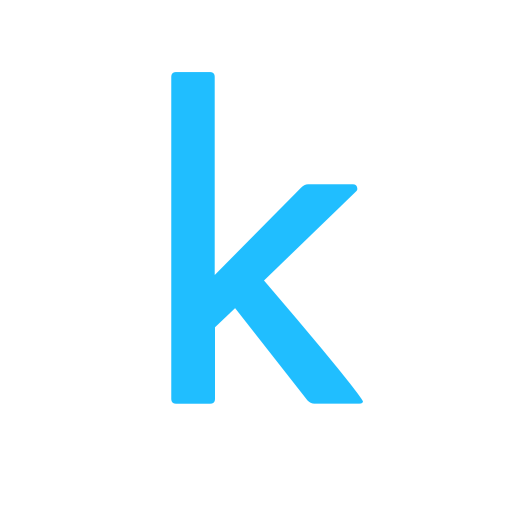
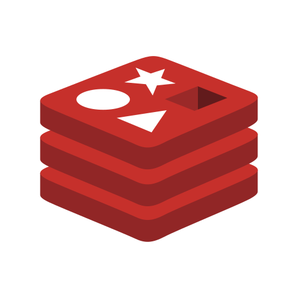

<h1 align="center">
</h1>

<h4 align="center">
  <code><a href="https://www.linkedin.com/in/arman-dogru/" title="LinkedIn Profile"> LinkedIn</a></code>
  <code><a href="mailto:arman.dogru@gmail.com" title="Email Me"> Gmail</a></code>
</h4>

 

  <strong>Ottawa, Ontario, Canada • 613-869-5958 • arman.dogru@gmail.com</strong>  
   
  I'm a <strong>Master’s student in Computer Science</strong> at the University of Ottawa (<em>specialising in Artificial Intelligence</em>),
  with <strong>3+ years of experience</strong> in software development, machine learning, and data science.
    
  <strong>Seeking</strong> a full-time software developer role in a dynamic environment (100+ employees).
    
  <em>
    🔭 My current projects focus on <strong>NLP, ML, and advanced AI methodologies</strong> to solve real-world problems. 
    🌱 I’m always learning, from building <strong>E-Commerce apps</strong> to <strong>LLM-driven systems</strong>. 
    💬 Ask me anything <a href="https://github.com/arman-dogru/arman-dogru/issues" title="Issues">here</a>!
  </em>

<h2 align="center">🔥 Technical Skills & Tools 🔥</h2>
 

<!-- Example table: you can keep them inline if you prefer -->

<!-- Programming & Scripting Languages -->
<h3 align="center">Programming & Scripting Languages</h3>

  <code></code>
  <code></code>
  <code></code>
  <code></code>
  <!-- Using MySQL icon to represent SQL -->
  <code></code>
  <code></code>
  <!-- No local R icon in the assets folder, fallback to original link -->
  <code></code>
  <code></code>
  <code></code>
  <code></code>
  <code></code>
  <code></code>

<!-- Frameworks & Libraries -->
<h3 align="center">Frameworks & Libraries</h3>

  <code></code>
  <code></code>
  <code></code>
  <code></code>
  <!-- Express, TensorFlow, PyTorch, Keras, scikit-learn, etc. do not exist locally -->
  <code></code>
  <code></code>
  <code></code>
  <code></code>
  <code></code>
  <code></code>
  <code></code>
  <code></code>
  <code></code>
  <code></code>
  <!-- Hugging Face not in assets -->
  <code></code>
  <code></code>
  <code></code>

<!-- Cloud & DevOps -->
<h3 align="center">Cloud & DevOps</h3>

  <code></code>
  <code></code>
  <!-- No local Kubernetes -->
  <code></code>
  <!-- Supabase not in assets -->
  <code></code>
  <!-- No local Apache Spark icons -->
  <code></code>
  <code></code>
  <code></code>
  <code></code>

<!-- Databases -->
<h3 align="center">Databases</h3>

  <code></code>
  <code></code>
  <code></code>
  <!-- Add more if you like (PostgreSQL, Oracle, etc.) -->

<!-- Other Tools -->
<h3 align="center">Other Tools</h3>

  <code></code>
  <code></code>
  <!-- No local Selenium -->
  <code></code>
  <!-- No local Stripe -->
  <code></code>
  <!-- No local Postman, Dask, Plotly icons -->
  <code></code>
  <code></code>
  <code></code>
  <!-- Using GitHub from the cloud folder -->
  <code></code>

<h2 align="center">🌟 Notable Projects 🌟</h2>
 

  <strong>Below are some of my most interesting repositories:</strong>

  
  

 

  
  

 

  
  

  
<h4 align="center">
  <a href="https://github.com/arman-dogru?tab=repositories" title="Show Repositories">🔎 Show More 🔍</a>
</h4>

<h2 align="center">⚡ GitHub Stats ⚡</h2>
 

  

<h2 align="center">👨‍💻 About Me & Highlights 👨‍💻</h2>
 

  <ul>
    <li><strong>Education</strong>: 
      <ul>
        <li>MSc in Computer Science, focusing on AI, at <em>University of Ottawa (2024-2026)</em> | Immersion & Merit Scholarships, total $31K</li>
        <li>BSc Honours in Computer Science, <em>University of Ottawa (2020-2024)</em> | Immersion & Merit Scholarships, total $212K | Dean’s Honour List, GPA: 3.5/4 (Cum Laude)</li>
      </ul>
    </li>
    <li><strong>Experience</strong>: 
      <ul>
        <li>Software Developer @ <em>Casa (San Francisco)</em> | Integrated Kotlin & Python for backend and LLM-based APIs</li>
        <li>Intern @ <em>SAS</em> (Ontario) | Created data solutions using SAS, SQL, Azure; built ML models with TensorFlow</li>
        <li>Intern @ <em>Shell</em> (Ontario) | Built REST APIs, used Java & Node.js, analyzed sales data with Spark & scikit-learn</li>
        <li>Research Student @ <em>uOttawa</em> | Reverse engineered audio with deep learning (PyTorch), improved accuracy by 15%</li>
        <li>Intern @ <em>SNG Studios</em> (Istanbul) | ML model for game analytics</li>
      </ul>
    </li>
    <li><strong>Projects</strong>:
      <ul>
        <li>Fake News Detection using LLMs (Mistral7B)</li>
        <li>Unsupervised Video Object Segmentation with Deformable CNNs</li>
        <li>Car Rental Android App (Kotlin & Firebase)</li>
        <li>Bohnanza Card Game in C++ with OOP & CMake</li>
        <li>Multi-Synth Audio Reverse Engineering (PyTorch)</li>
        <li>Full-Stack Web Apps (React, SQL, Stripe, Node.js)</li>
      </ul>
    </li>
  </ul>

  Outside of work, I’m a <strong>Technical Founder at PropT Platforms</strong>, building an AI-driven marketplace with 
  <strong>React, GPT, and advanced ML</strong>. Selected for 
  <strong>Invest Ottawa’s Startup Accelerator Program</strong>. 

  I love <strong>collaborating on high-impact software</strong>, pushing the boundaries of 
  <strong>AI, ML, data science, and full-stack development</strong>.

  <strong>📫 Feel free to reach me at <a href="mailto:arman.dogru@gmail.com">arman.dogru@gmail.com</a></strong>

